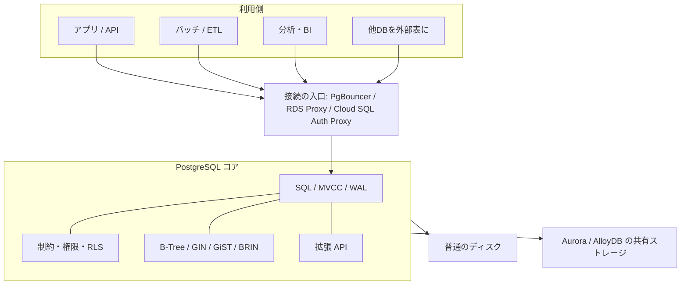
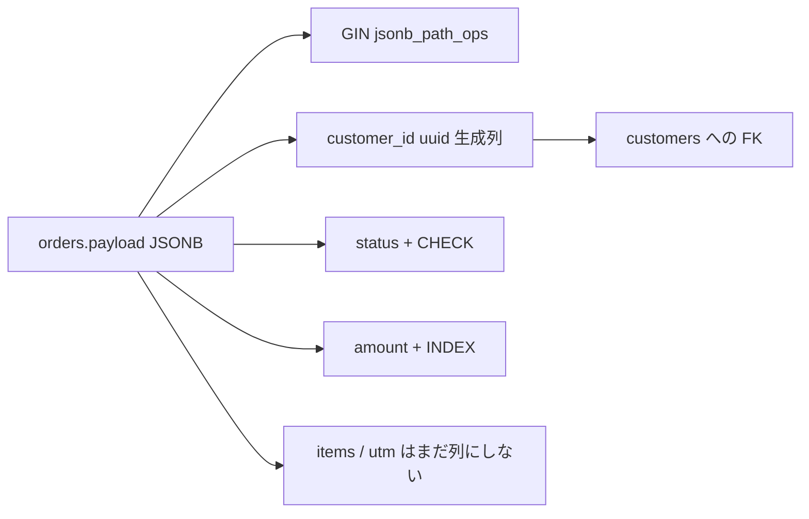
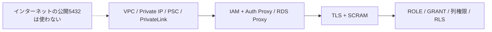

# PostgreSQL の強み（RDB・拡張・クラウド）

AWS や GCP を使うほど、RDB の既定値が PostgreSQL に寄って見える理由を、図と表で整理したメモです。投資判断ではなく機能の地図です。

ブラウザ向けの同じ内容: [`postgresql.html`](../postgresql.html)（`npm run postgresql` → http://localhost:1237/postgresql.html）。

このリポジトリの家計簿・ニュース・レシートツールとは独立した静的解説で、データベースには接続しません。

## 1. 全体像



| 気づき | 意味 | 他エンジンとの差 |
| --- | --- | --- |
| マネージドの第一選択肢が PG | RDS、Aurora PostgreSQL、Cloud SQL、AlloyDB が同じ方言に寄る | Oracle はライセンス、MySQL はフォーク差が大きい |
| 拡張が製品機能になる | PostGIS / pgvector / pgaudit をチェックで有効化 | GIS・ベクトル・監査を別製品に分けなくて済むことが多い |
| 接続がプロキシ前提 | IAM + Auth Proxy / RDS Proxy | パスワードをアプリに焼かない運用が作りやすい |
| 論理レプリケーションが標準 | メジャーバージョン越えやクラウド間のオンライン移行 | ダンプだけに頼らず切り返し計画が立てやすい |

## 2. ベース RDB としての強さ

拡張の前に、素の PostgreSQL がすでに厳しい RDB です。MVCC（長い SELECT が書き込みを止めない）、トランザクション DDL、CHECK / EXCLUDE / 部分 UNIQUE、CTE・WINDOW・LATERAL、多様な索引が「JSON や GIS を足しても破綻しない」土台です。

| 領域 | 拡張なしでできること |
| --- | --- |
| SQL | CTE、再帰 CTE、WINDOW、LATERAL、DISTINCT ON、MERGE（15+）、生成列、IDENTITY |
| 型 | 数値・日時・UUID・配列・レンジ・ENUM・JSONB・tsvector |
| 索引 | B-Tree、Hash、GiST、SP-GiST、GIN、BRIN。部分索引・式索引・INCLUDE |
| その他 | LISTEN/NOTIFY、パーティション、パラレルクエリ |

| 観点 | PostgreSQL | MySQL / MariaDB | Oracle | SQL Server |
| --- | --- | --- | --- | --- |
| 標準 SQL | 強い | 普通 | 強い（ロックイン大） | 強い（T-SQL） |
| 型と索引 | JSONB + GIN が本家品質 | JSON はあるが限定的 | 強いがオプション課金になりやすい | JSON / 空間は後付け感 |
| 拡張 | `CREATE EXTENSION` | プラグイン文化が薄い | オプション製品の束 | CLR 等は別物 |
| クラウド間の持ち出し | 各社が互換エンジンを出す | フォーク差 | ライセンス | Azure に寄る |
| 書き込み水平分割 | 単一プライマリが基本 | 同様 | RAC 等は別スキル | Always On は可用性寄り |

Spanner / CockroachDB のグローバル書き込みは別種です。PostgreSQL 互換をうたっていても、制約・拡張・トランザクションの意味がずれます。

## 3. JSONB でありながら正規化して扱える

JSONB は schemaless に見えて、生成列・制約・外部キー・GIN で関係モデルに接続できます。よく使うキーだけ列に昇格し、残りは JSONB に残します。



|  | json | jsonb | 関係列 |
| --- | --- | --- | --- |
| 保存 | 入力テキストに近い | 分解バイナリ | 型どおり |
| 索引 | 向かない | GIN、JSONPath、`@>` | B-Tree |
| 制約 | CHECK 程度 | 生成列経由が本命 | FK / UNIQUE / CHECK |
| 向くデータ | 原文が欲しい監査 | 変動キー、外部 API の余り | 結合・集計・金額・ステータス |

```sql
CREATE TABLE orders (
  id uuid PRIMARY KEY DEFAULT gen_random_uuid(),
  payload jsonb NOT NULL,
  customer_id uuid GENERATED ALWAYS AS ((payload->>'customer_id')::uuid) STORED,
  status text GENERATED ALWAYS AS (payload->>'status') STORED,
  amount integer GENERATED ALWAYS AS ((payload->>'amount')::integer) STORED,
  CONSTRAINT orders_status_chk CHECK (status IN ('draft', 'paid', 'void')),
  CONSTRAINT orders_amount_chk CHECK (amount >= 0),
  CONSTRAINT orders_customer_fk FOREIGN KEY (customer_id) REFERENCES customers (id)
);
CREATE INDEX orders_payload_gin ON orders USING gin (payload jsonb_path_ops);
CREATE INDEX orders_customer_idx ON orders (customer_id);
```

列にする条件の目安: 検索する、結合する、金額として集計する。

## 4. 拡張機能

| 拡張 | できること | RDS / Aurora PG | Cloud SQL / AlloyDB |
| --- | --- | --- | --- |
| PostGIS | 空間型と距離・包含 | 利用可 | 利用可 |
| pgvector | 近傍検索 | 比較的新しい版で可 | 利用可（AlloyDB は強化） |
| pgcrypto | ハッシュ、pgp、UUID | 利用可 | 利用可 |
| pg_trgm | `LIKE '%foo%'` を索引付きで | 利用可 | 利用可 |
| postgres_fdw | 別 PG を外部表に | 利用可 | 利用可 |
| pgaudit | 監査ログ | 利用可 | 利用可 |
| pg_stat_statements | 遅い SQL の集計 | 利用可 | 利用可 |
| ltree / hstore / citext | 木、古い K/V、大小無視 | 利用可 | 利用可 |
| TimescaleDB / Citus | 時系列、分散シャード | 原則なし | 原則なし |

マネージドでは許可リスト以外の拡張はほぼ不可。拡張の有無はクラウド間移行の最大のつまずきでもあります。製品の対応表はバージョンで変わるので、採用前に各社ドキュメントを確認してください。

## 5. スケール

左ほどマネージドが肩代わりし、右ほどエンジンの外の仕事です。プロセスモデルなので、スケールの前に接続プールが効きます。

1. 垂直（インスタンス変更）— 容易
2. 接続プール — 容易、ほぼ必須
3. Aurora / AlloyDB の容量と I/O — 容易
4. リードレプリカ — 普通（遅延と書き込み集中）
5. 宣言的パーティション — 普通
6. 書き込みシャーディング（Citus / 自前）— 難しい

| 手段 | 伸ばすもの | 容易性 | 落とし穴 |
| --- | --- | --- | --- |
| インスタンス大型化 | CPU / メモリ | 容易 | 上限、メンテ |
| 接続プール | 同時接続 | 容易 | 一時表や LISTEN との相性 |
| Aurora / AlloyDB ストレージ | 容量、フェイルオーバー | 容易 | 固有機能は持ち出しにくい |
| リードレプリカ | 参照 QPS | 普通 | 遅延 |
| パーティション | 巨大表のメンテ | 普通 | キー設計 |
| 論理レプリで分析へ | OLTP と OLAP の分離 | 普通 | DDL、シーケンス |
| シャーディング | 書き込み | 難しい | クロスシャード結合 |

## 6. 移行

PG→PG は `pg_dump` と論理レプリケーションがオープンなので道具が流用できます。MySQL / Oracle からは変換が本体です。

| 手段 | 停止時間 | 向くケース | 注意 |
| --- | --- | --- | --- |
| pg_dump / restore | サイズに比例 | 小さい DB、検証 | 権限・拡張・照合順序 |
| 物理バックアップ | 短いがメンテは必要 | 同一メジャー | マネージドでは使えないことが多い |
| 論理レプリケーション | 切り替えを短くできる | PG→PG、バージョン上げ | DDL、シーケンス、スロット |
| AWS DMS / GCP DMS | 設計次第 | 他エンジンから | 型マッピング |
| postgres_fdw | 表単位 | 段階移行 | 結合性能 |

容易になる条件: 先方に同じ拡張がある、照合順序を揃える、superuser 前提を捨てる、Aurora/AlloyDB 固有機能に依存しない。

## 7. 接続の安全性



| 層 | PostgreSQL 本体 | AWS | GCP |
| --- | --- | --- | --- |
| 認証 | SCRAM-SHA-256、クライアント証明書 | IAM DB 認証、Secrets Manager | IAM DB 認証、Secret Manager |
| 接続の出し方 | `sslmode=verify-full` | RDS Proxy | Cloud SQL / AlloyDB Auth Proxy |
| ネットワーク | `listen_addresses` | VPC、SG、PrivateLink | VPC、PSC、VPC SC |
| 認可 | GRANT、RLS | IAM は接続まで。表権限は SQL | 同様 |
| 監査・暗号 | pgaudit、pgcrypto | KMS、CloudTrail | CMEK、Cloud Audit Logs |

IAM でログインできても SELECT の範囲は GRANT と RLS です。プロキシ経由だとクライアント IP が全部プロキシに見えるので、`pg_hba` を IP 頼りにしない方がよいです。

## 8. AWS / GCP 対応

| やりたいこと | AWS | GCP | PostgreSQL 側 |
| --- | --- | --- | --- |
| 普通の OLTP | RDS for PostgreSQL | Cloud SQL for PostgreSQL | 素の PG に近い |
| フェイルオーバーと I/O | Aurora PostgreSQL | AlloyDB | SQL は PG、ストレージは独自 |
| 分析も少し寄せたい | レプリカ / 倉庫へ複製 | AlloyDB 列指向 | プロトコルは維持 |
| 地図 | PostGIS | PostGIS | 空間型と GiST |
| ベクトル | pgvector | pgvector / AlloyDB AI | 関係データと JOIN |
| 接続の秘密を減らす | IAM + RDS Proxy | IAM + Auth Proxy | ロールは DB 内 |
| グローバル読み取り | Aurora Global | クロスリージョンレプリカ | 書き込みリージョンは一つが基本 |

## 9. 向いていないこと

| やりたいこと | 現実 | 代わり |
| --- | --- | --- |
| 書き込みの水平分割 | 単一プライマリが基本 | シャード専用製品 |
| サーバレスでゼロ運用 | 接続と VACUUM は残る | 運用が消えるわけではない |
| 巨大入れ子 JSON を主データに | 行書き換えと GIN 肥大 | ホットキーは列へ |
| 任意の拡張 | 許可リスト以外は不可 | 必要拡張で基盤を決める |
| ペタバイトの倉庫 SQL | OLTP の仕事ではない | BigQuery / Redshift へ複製 |

強さの核は、RDB の約束（制約・トランザクション・SQL）を捨てずに、JSON・GIS・ベクトル・監査を同じバックアップ単位に足せることです。AWS と GCP はその核を壊さずに、接続・ディスク・フェイルオーバーだけを製品化しています。
